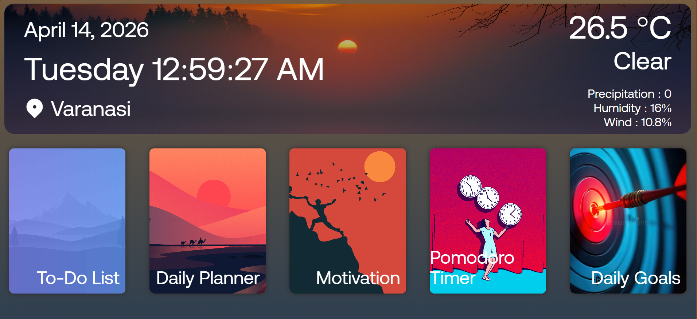

# Personal Productivity Dashboard

A sleek, minimalist, and functional web-based dashboard designed to streamline your daily workflow. This project combines essential productivity tools—like a Pomodoro timer, To-Do list, and Daily Planner—into a single, beautiful interface.


## 🚀 Features

- **Live Weather & Time:** Integrated weather widget and real-time clock to keep you grounded.
- **Interactive To-Do List:** Manage your tasks efficiently with local persistence.
- **Daily Planner:** Map out your day from 6:00 AM to midnight.
- **Pomodoro Timer:** Boost focus with a dedicated 25-minute timer.
- **Daily Motivation:** Get inspired with a new quote every time you visit.
- **Responsive Design:** Optimized for various screen sizes with smooth CSS transitions.

## 🛠️ Tech Stack

- **HTML5** - Semantic structure.
- **CSS3** - Custom properties, CSS Grid, and Flexbox for a modern layout.
- **JavaScript (Vanilla)** - DOM manipulation, Asynchronous API calls, and LocalStorage.
- **Remix Icon** - For crisp, scalable iconography.

## 📦 Installation & Setup

1. **Clone the repository:**
   ```bash
   git clone https://github.com/your-username/personal-dashboard.git
   ```
2. **Configure API Keys:**
   Create a `config.js` file in the root directory and add your Weather API credentials:
   ```javascript
   const CONFIG = {
       WEATHER_API_KEY: 'your_api_key_here',
       BASE_URL: 'https://api.weatherapi.com/v1/current.json',
       LOCATION: 'your_city'
   };
   ```
3. **Open the project:**
   Simply open `index.html` in your preferred web browser.

## 📝 Customization

- **Fonts:** The project uses the "Aeonika" font family. Ensure the `.otf` files are in the root directory or update `style.css` to use a system font.
- **Colors:** You can easily change the theme by modifying the `:root` variables in `style.css`.

## 📄 License

This project is open-source and available under the MIT License.

---
*Built to help you stay organized and inspired.*
